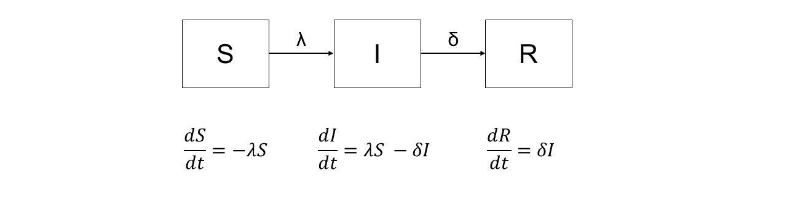
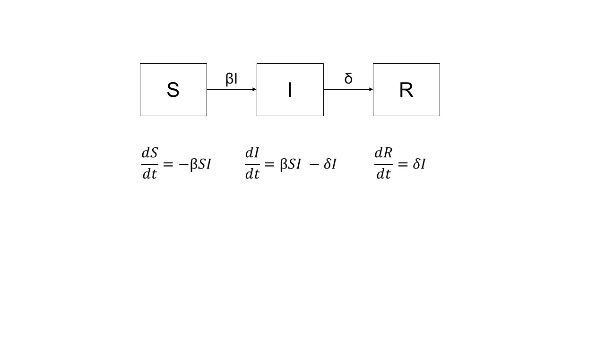
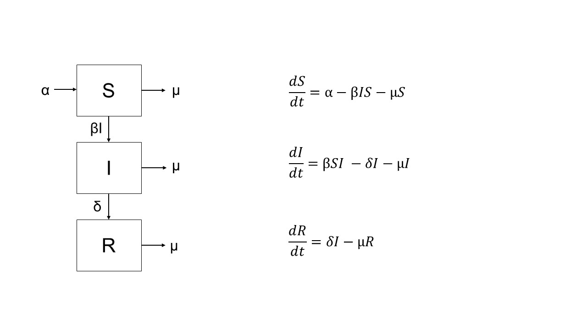
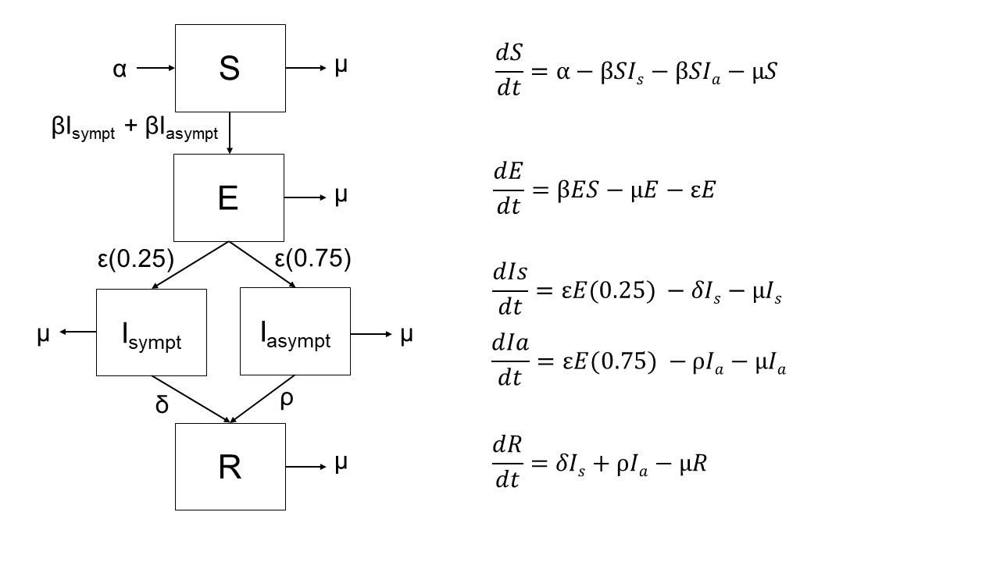
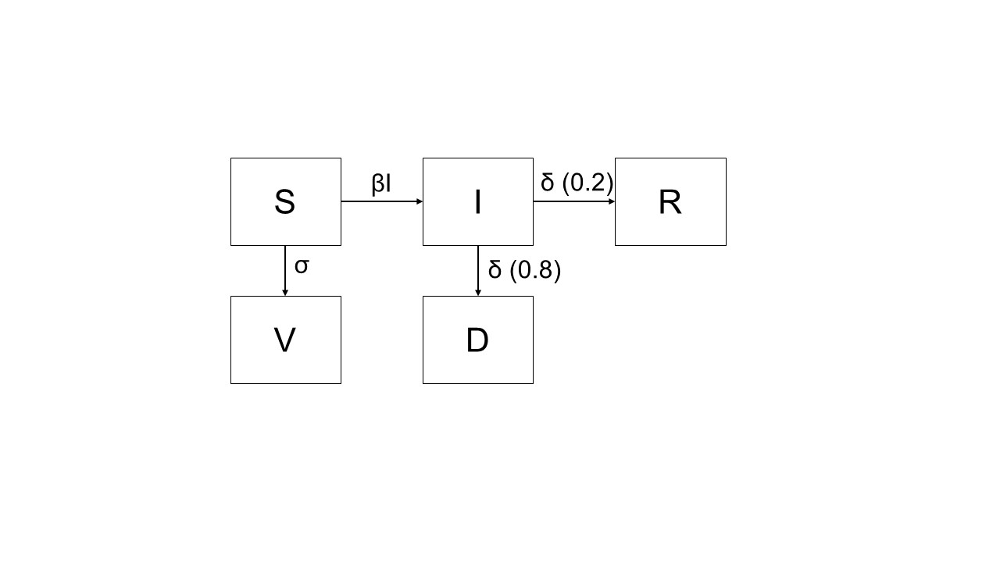

```{r setup, include=FALSE}
knitr::opts_chunk$set(echo = TRUE)

if(!require('pacman')) {
  install.packages('pacman')
}
pacman::p_load(dplyr, ggplot2, RColorBrewer, deSolve)
```

Introduction based on content from *Modeling Infectious Diseases in Humans and Animals* by Matt J. Keeling and Pejman Rohani and *Back of the Envelope Modelling of Infectious Disease Transmission Dynamics for Veterinary Students* by Gary Smith. Both are available for online access via the [Penn library](https://www.library.upenn.edu/). Code adapted from Michael Levy.


# Infectious Disease Models
Infectious disease models serve two primary purposes: prediction (for example, deciding between two infectious disease control methods or determining how large an epidemic might spread) and understanding (for example, how does a change in the number of sexual partners impact STI spread, or the impact of other very specific parameter changes). Unfortunately, since models are built on generalizations, even the most precise are still imperfect. 

# Terminology
**Deterministic** infectious disease models will always produce the same results given the same inputs (this can be contrasted with **stochastic** models, which incorporate an element of randomness and therefore will be different across model runs even with the same inputs provided). 

**Susceptible** is a characteristic of an individual in a population where they could potentially acquire a given infectious disease.

**Infected** is generally used to mean that an individual has been colonized by an infectious agent.

**Recovered** indicates that an individual has cleared an infectious agent. It also usually means that the individual is immune to re-infection by that agent as long as they remain in the "recovered" state. 

**Force of infection** is written as $\lambda$ and is the per capita rate at which susceptible individuals contract the infection. The rate at which new infecteds are produced is represented by $\lambda$X, where X is the number of individuals who are susceptible.

**Basic Reproductive Ratio** is commonly indicated by $R_0$. It is defined as "the average number of secondary cases arising from an average primary case in an entirely susceptible population" (Keeling & Rohani).

**Frequency dependent transmission**, also referred to as mass action transmission, is when the spread of a disease is not impacted by population size. This type of spread is represented by the formula $\lambda$=($\beta$Y)/N where Y is the number of infectious individuals, N is the total population size, and $\beta$ is the contact rate times transmission probability. If the force of infection is frequency dependent then $\lambda$ is proportional to the prevalence of infectious hosts. This is probably the most commonly used transmission assumption for human diseases.

**Density dependent transmission** is sometimes also referred to as pseudo mass action transmission, and assumes that as the size of the population increases, so does the contact rate, and therefore the spread of infection. It is represented by $\lambda$=$\beta$Y. If the force of infection is density dependent then $\lambda$ is proportional to the density of infectious hosts. 

# Basic Compartmental Models
## SIR Model
Compartmental models can be visualized by separating individuals into distinct "compartments" based on disease state. For example, if we were to draw a compartmental model of a single strain of influenza and assume no vaccination, we might use S, I, and R compartments. An individual starts as susceptible, then may move to infected if they come into contact with an infected individual. Finally, they clear the infection and move to recovered. (Note that this assumes no population dynamics such as birth or death, aka a "closed population," and that the individual can't die from the infection.) This process could be visualized as follows:


This visualization is missing one important component - the movements between compartments. In this example, $\lambda$ represents the rate at which transmission occurs (S to I), and we will use $\delta$ to represent the rate at which individuals move from I to R (a "transition"). This gives us:


Next, we want to write equations for these rates of change between compartments. Each box should have a corresponding differential equation.


In this example, $\delta$ represents the removal/recovery rate. Another useful parameter is $\frac{1}{\delta}$, which is the average infectious period.

## Lambda in Frequency and Density Dependent Transmission
The force of infection, $\lambda$, is given by the following equation: $\lambda$=cp$\pi$ where $p$ is the probability of contact with an infectious host ($p$ = I/N), and $\pi$ is the conditional probability that transmission actually occurs. 

In frequency dependent transmission, $\beta$ = $\kappa_1$$\pi$.
In density dependent transmission, $\beta$ = $\kappa_2$$\pi$/$A.

### Frequency Dependent Transmission
In frequency dependent transmission, we assume that $c$ is the same regardless of the size of the population (N). $c$ can then be replaced with a constant, $\kappa_{1}$. This gives us the re-written equation $\lambda$=$\kappa_{1}$$\frac{I}{N}$$\pi$. We can substitute this into our earlier equation for $\frac{dS}{dt}$ to get:

$\frac{dS}{dt}$ = -$\kappa_{1}$$\frac{I}{N}$$\pi$S. 

This is usually simplified to $\frac{dS}{dt}$ = -$\beta$$\frac{I}{N}$S.

$\beta$ is often called the transmission coefficient. 

This is the most commonly used transmission type for most human infectious diseases. So assuming that our SIR model has frequency dependent transmission, we can re-write our differential equations as:



### Density Dependent Transmission
In density dependent transmission we assume that the rate of contact is proportional to the total host density (N/A). This gives us the following equation:
c = $\kappa_2$ $\frac{N}{A}$ where $\kappa_2$ is a constant of proportionality.

Substituting this into our equation for $\lambda$ we get:
$\lambda$ = c $\frac{I}{N}$$\pi$ = $\kappa_2$ $\frac{N}{A}$ $\frac{I}{N}$ $\pi$.

This can be reduced to: $\lambda$ = $\kappa_2$ $\frac{I}{A}$ $\pi$. 

## Threshold Phenomenon and $R_0$
How can we determine whether a given pathogen will create an epidemic or "burn out"? 

Imagine a scenario where a single infected individual is inserted into a susceptible population. If the initial fraction of susceptibles is less than the recovery rate divided by the transmission coefficient ($\frac{\delta}{\beta}) then $\frac{dI}{dt} < 0 and the infection will die out. This means that the relative removal rate must be small enough for the infection to spread.

The inverse of the relative removal rate is the basic reproductive ratio, or $R_0$. Re-working the statements above, we can say that an infection will only invade a population if $R_0$ > 1. (Intuitively, this makes sense.) One of the diseases with the highest $R_0$ is measles (~16-18). In contrast, the $R_0$ for smallpox is ~3.5-6 and ~3-4 for some strains of influenza. 

## Plotting an SIR model
```{r SIR function}
#Assume frequency-dependent transmission
#Write a function for the SIR model
sir <- function(time, state, parameters) 
	{
	with(
		 as.list(c(state, parameters)), 
			{
			dS <- -beta * S * I
			dI <- beta * S * I - delta * I
			dR <- delta * I
			return(list(c(dS, dI, dR)))
		    }
		 )
}

#Parameterize the model
#Provide initial values for S, I, and R; parameters; and time points
init <- c(S = 99, I = 1, R = 0)
parameters <- c(beta = .01, delta = 0.1)
times <- seq(0, 70, by = 1)

#Run the model
out <- as.data.frame(ode(y = init, times = times, func = sir, parms = parameters))
S <- out$S
I <- out$I
R <- out$R

results <- reshape2::melt(as.data.frame(as.matrix(out)), id = "time") %>%
      mutate(state = substring(variable,1,1))

#Visualize the results
pal1 <- c("S" = "lightgreen",
          "I" = "darkred",
          "R" = "skyblue")

fig_SIR <- ggplot() + 
  theme_bw() + 
  geom_line(data = results, aes(x = time, y = value, group = variable, color = state), linewidth = 1) + 
  scale_color_manual(values = pal1, name = "Disease State", breaks=c("S","I","R")) + 
  ggtitle("SIR Model version 1") +
  xlab("Time") +
  ylab("Number per Disease State")

fig_SIR

```

We can also use this information to calculate the basic reproductive ratio ($R_0$).

```{r R0}

getR0 <- function(beta, delta, N) {
  R0 <- (beta*N)/delta
    print(R0)
}

N <- sum(init)
values <- c(parameters, N = N)

rlang::exec(getR0, !!! values)
```
What happens if we change the parameters (beta and delta) in our SIR model? Let's make the value for delta (the recovery rate) smaller.
```{r SIR v 2}
#Re-parameterize the model
init <- c(S = 99, I = 1, R = 0)
parameters <- c(beta = .01, delta = 0.001)
times <- seq(0, 70, by = 1)

#Run the model
out <- as.data.frame(ode(y = init, times = times, func = sir, parms = parameters))
S <- out$S
I <- out$I
R <- out$R

results <- reshape2::melt(as.data.frame(as.matrix(out)), id = "time") %>%
      mutate(state = substring(variable,1,1))

#Visualize the results
pal1 <- c("S" = "lightgreen",
          "I" = "darkred",
          "R" = "skyblue")

fig_SIR2 <- ggplot() + 
  theme_bw() + 
  geom_line(data = results, aes(x = time, y = value, group = variable, color = state), linewidth = 1) + 
  scale_color_manual(values = pal1, name = "Disease State", breaks=c("S","I","R")) + 
  ggtitle("SIR Model version 2") +
  xlab("Time") +
  ylab("Number per Disease State")

fig_SIR2

#R0
N <- sum(init)
values <- c(parameters, N = N)
rlang::exec(getR0, !!! values)
```

## SIR Model with Population Demographics
Our previous models ignored population demographics (births and deaths), which we know isn't realistic. Here, we add in a birth rate, $\alpha$, of 1.1 (2021 data from CDC indicates a US birth rate of 11/1,000 population; our population here is 100) and a (fake) death rate, $\mu$, of 0.005. We assume that all individuals who are born are immediately susceptible, and that disease status has no impact on your likelihood of death.



```{r SIR population demographics}
#We need a new function that takes into account our population demographics
sirdemog <- function(time, state, parameters) 
	{
	with(
		 as.list(c(state, parameters)), 
			{
			dS <- alpha - (beta * S * I) - (mu * S)
			dI <- (beta * S * I) - (delta * I) - (mu * I)
			dR <- (delta * I) - (mu * R)
			return(list(c(dS, dI, dR)))
		    }
		 )
}

#Parameterize the model
#Provide initial values for S, I, and R; parameters; and time points
init <- c(S = 99, I = 1, R = 0)
parameters <- c(beta = .01, delta = 0.1, alpha = 1.1, mu = 0.005)
times <- seq(0, 70, by = 1)

#Run the model
out <- as.data.frame(ode(y = init, times = times, func = sirdemog, parms = parameters))
S <- out$S
I <- out$I
R <- out$R

results2 <- reshape2::melt(as.data.frame(as.matrix(out)), id = "time") %>%
      mutate(state = substring(variable,1,1))

#Visualize the results
pal1 <- c("S" = "lightgreen",
          "I" = "darkred",
          "R" = "skyblue")

fig_SIR_demog <- ggplot() + 
  theme_bw() + 
  geom_line(data = results2, aes(x = time, y = value, group = variable, color = state), linewidth = 1) + 
  scale_color_manual(values = pal1, name = "Disease State", breaks=c("S","I","R")) + 
  ggtitle("SIR Model with Population Demographics") +
  xlab("Time") +
  ylab("Number per Disease State")

fig_SIR_demog
fig_SIR

```

## Variations on the SIR model
Compartmental models can be made more complex to account for additional disease states. A common addition is "exposed", a status where someone has been infected but is not yet infectious (this is called an SEIR model). If we were interested in the number of symptomatic versus asymptomatic cases of COVID-19, we could replace the "infected" compartment with "symptomatic" and "asymptomatic" compartments. In this scenario, we're assuming that individuals are more likely to become asymptomatic than symptomatic, and that the two groups recover at different rates.



```{r SEIR symp and asmpt}
#New function
seir <- function(time, state, parameters) 
	{
	with(
		 as.list(c(state, parameters)), 
			{
			dS <- alpha - (beta * S* Is) - (beta * S * Ia) - (mu * S)
			dE <- (beta * S * Is) + (beta * S * Ia) - (epsilon * 0.25 * E) - (epsilon * 0.75 * E) - (mu * E)
			dIs <- (epsilon * 0.25 * E) - (delta * Is) - (mu * Is)
			dIa <- (epsilon * 0.75 * E) - (rho * Ia) - (mu * Ia)
			dR <- (epsilon * Is) + (rho * Ia) - (mu * R)
			return(list(c(dS, dE, dIs, dIa, dR)))
		    }
		 )
}

#Parameterize the model
init <- c(S = 98, E = 0, Is = 1, Ia = 1, R = 0)
parameters <- c(beta = .1, epsilon = 0.2, rho = 0.1, delta = 0.05, alpha = 1.1, mu = 0.05)
times <- seq(0, 100, by = 1)

#Run the model
out <- as.data.frame(ode(y = init, times = times, func = seir, parms = parameters))
S <- out$S
E <- out$E
Is <- out$Is
Ia <- out$Ia
R <- out$R

results3 <- reshape2::melt(as.data.frame(as.matrix(out)), id = "time") %>%
      mutate(state = substring(variable, 1, 5))

#Visualize the results
pal2 <- c("S" = "lightgreen",
          "E" = "goldenrod1",
          "Is" = "firebrick1", 
          "Ia" = "firebrick",
          "R" = "dodgerblue")

fig_SEIR <- ggplot() + 
  theme_bw() + 
  geom_line(data = results3, aes(x = time, y = value, group = variable, color = state), linewidth = 1) + 
  scale_color_manual(values = pal2, name = "Disease State", breaks=c("S", "E", "Is", "Ia", "R")) + 
  ggtitle("SEIR Model with Symptomatic and Asymptomatic Disease States") +
  xlab("Time") +
  ylab("Number per Disease State")

fig_SEIR

```

# Practice Exercise
We discovered a new pathogen that follows an SIR model. We quickly developed a lifelong, non-waning vaccine and want to model its effect on disease spread in the population. Assume a population of 1000, with one infected individual to start, and the following parameters: beta = 0.002, delta = 0.05, and 80% of individuals who get infected will die (at the same rate as those who recover). Assume no births or deaths. What does the disease curve over 100 time points look like with a per capita vaccination rate of 0.05? 0.25? 0.5?



```{r SIR vax}
sirvax <- function(time, state, parameters) 
	{
	with(
		 as.list(c(state, parameters)), 
			{
			dS <- (-beta * S * I) - (sigma * S)
			dV <- (sigma * S)
			dI <- (beta * S * I) - (delta * I)
			dD <- (delta * I * 0.8)
			dR <- (delta * I * 0.2)
			return(list(c(dS, dV, dI, dD, dR)))
		    }
		 )
}

#Parameterize the model
init <- c(S = 999, V = 0, I = 1, D = 0, R = 0)
parameters <- c(beta = .002, delta = 0.05, sigma = 0.05)
times <- seq(0, 100, by = 1)

#Run the model
out <- as.data.frame(ode(y = init, times = times, func = sirvax, parms = parameters))
S <- out$S
V <- out$V
I <- out$I
D <- out$D
R <- out$R

results <- reshape2::melt(as.data.frame(as.matrix(out)), id = "time") %>%
      mutate(state = substring(variable, 1, 5))

#Visualize the results
pal1 <- c("S" = "lightgreen",
          "V" = "darkorchid",
          "I" = "darkred",
          "D" = "black",
          "R" = "dodgerblue")

fig_vax1 <- ggplot() + 
  theme_bw() + 
  geom_line(data = results, aes(x = time, y = value, group = variable, color = state), linewidth = 1) + 
  scale_color_manual(values = pal1, name = "Disease State", breaks=c("S","V", "I", "D", "R")) + 
  ggtitle("SIR Model with Vaccination (0.05)") +
  xlab("Time") +
  ylab("Number per Disease State")

fig_vax1

## Vax rate of 0.5
init <- c(S = 999, V = 0, I = 1, D = 0, R = 0)
parameters <- c(beta = .002, delta = 0.05, sigma = 0.25)
times <- seq(0, 100, by = 1)

#Run the model
out <- as.data.frame(ode(y = init, times = times, func = sirvax, parms = parameters))
S <- out$S
V <- out$V
I <- out$I
D <- out$D
R <- out$R

results <- reshape2::melt(as.data.frame(as.matrix(out)), id = "time") %>%
      mutate(state = substring(variable, 1, 5))

fig_vax2 <- ggplot() + 
  theme_bw() + 
  geom_line(data = results, aes(x = time, y = value, group = variable, color = state), linewidth = 1) + 
  scale_color_manual(values = pal1, name = "Disease State", breaks=c("S","V", "I", "D", "R")) + 
  ggtitle("SIR Model with Vaccination (0.25)") +
  xlab("Time") +
  ylab("Number per Disease State")

fig_vax2

##Vax rate of 0.75
init <- c(S = 999, V = 0, I = 1, D = 0, R = 0)
parameters <- c(beta = .002, delta = 0.05, sigma = 0.5)
times <- seq(0, 100, by = 1)

#Run the model
out <- as.data.frame(ode(y = init, times = times, func = sirvax, parms = parameters))
S <- out$S
V <- out$V
I <- out$I
D <- out$D
R <- out$R

results <- reshape2::melt(as.data.frame(as.matrix(out)), id = "time") %>%
      mutate(state = substring(variable, 1, 5))

fig_vax3 <- ggplot() + 
  theme_bw() + 
  geom_line(data = results, aes(x = time, y = value, group = variable, color = state), linewidth = 1) + 
  scale_color_manual(values = pal1, name = "Disease State", breaks=c("S","V", "I", "D", "R")) + 
  ggtitle("SIR Model with Vaccination (0.5)") +
  xlab("Time") +
  ylab("Number per Disease State")

fig_vax3
```

