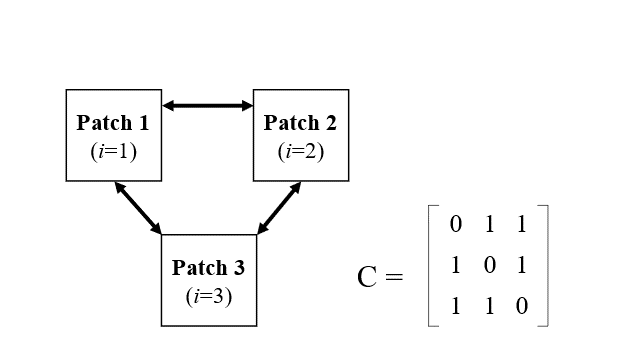
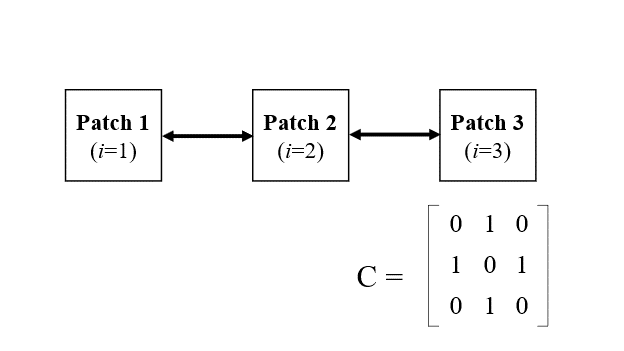
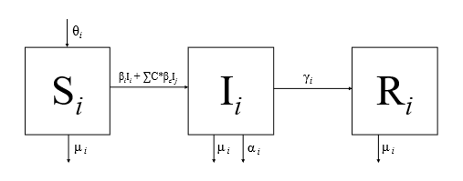

```{r setup, include=FALSE}
knitr::opts_chunk$set(echo = TRUE)
```

## Background  

+ Metapopulations models simplified: the overall population is divided into subpopulations (pathches). Infectious disease dynamics operate at two levels: within patches and between patches

+ Deterministic patch model set up:  

  + n patches  
  
  + within each ith patch, SIR type dynamics  
  
  + between patches, some contact matrix, C, scales the strength of transmission ("coupling")  
  
**Reference:** Ecology, genetics and evolution of metapopulations, Chapter 17: Metapopulation dynamics of infectious diseases, Keeling et al. 2004.  


## Example model set up

We'll look at two different configurations of a model system with 3 patch systems with SIR within patch dynamics.

**Schematics of two different *between* patch dynamics**  
&nbsp;&nbsp;&nbsp;&nbsp;&nbsp;&nbsp;
Example 1: all patches interact with each other equally

&nbsp;&nbsp;&nbsp;&nbsp;&nbsp;&nbsp;


&nbsp;&nbsp;&nbsp;&nbsp;&nbsp;&nbsp;
Example 2: patches in a row, not all patches interact with each other

&nbsp;&nbsp;&nbsp;&nbsp;&nbsp;&nbsp;
   

**Schematic of *within* patch dynamics**  

  

**System of ODEs for n=3 patches**   

&nbsp;  
&nbsp;&nbsp;&nbsp;&nbsp;&nbsp;&nbsp;
$\frac{dS}{dt} = \theta_iN - \beta_i S_i I_i - (\sum_{j=1}^3 \beta_cC*I_j)- \mu_iS_i$  

&nbsp;&nbsp;&nbsp;&nbsp;&nbsp;&nbsp;
$\frac{dI}{dt} = \beta_i S_i I_i + (\sum_{j=1}^3 \beta_cC*I_j) - \gamma_iI_i - \alpha_iI_i - \mu_iI_i$  

&nbsp;&nbsp;&nbsp;&nbsp;&nbsp;&nbsp;
$\frac{dR}{dt} = \gamma_iI_i - \mu_iR_i$  


## Code  

Set up  
```{r, message=FALSE, warning=FALSE}
#clean environment
rm(list = ls()) 

#load libraries
library(dplyr)
library(ggplot2)
library(deSolve)
```

Functions to format input of model
```{r}

#initial state conditions
rfun.FormatInit <- function(init.df){
  
  #create flexible naming structure for vectors
  l <- nrow(init.df)
  state.names <- as.vector(colnames(init.df))
  varnames <- NULL
  for(i in 1:length(state.names)){
    varnames <- cbind(varnames, paste(state.names[i], seq(1:l), sep=""))
  }
  as.vector(varnames)

  #vectorize matrix input
  init.vector <- as.vector(as.matrix(init.df))
  
  
  names(init.vector) = varnames
  return(init.vector)
}

#parameters
rfun.FormatParams <- function(parm.df){
  
  #create flexible naming structure for vectors
  l <- nrow(parm.df)
  parm.names <- as.vector(colnames(parm.df))
  varnames <- NULL
  for(i in 1:length(parm.names)){
    varnames <- cbind(varnames, paste(parm.names[i], seq(1:l), sep=""))
  }
  as.vector(varnames)

  #vectorize matrix input
  parm.vector <- as.vector(as.matrix(parm.df))
  
  
  names(parm.vector) = varnames
  return(parm.vector)
}

#Contact matrix
rfun.FormatContact = function(df.contact, beta.contact_constant){
  l = length(df.contact)
  matrix.contact  = as.matrix(df.contact, ncol=4)
  return(beta.contact_constant*matrix.contact)
}
```

Specify model
```{r}
MODEL <- function(time, state, parameters, beta.contact) {
  with(as.list(c(state, parameters)), {
    
    #number of cells
    l1 = length(state)
    l2 = length(unique(substr(names(state),1,1)))
    l = l1/l2
    
    #Define initial conditions
    S = matrix(state[1:l], ncol=1)
    I = matrix(state[(l+1):(2*l)], ncol=1)
    R = matrix(state[(2*l+1):(3*l)], ncol=1)
    
    #Define params
    beta <- matrix(parameters[paste0("beta", 1:l)], ncol=1)
    gamma <- matrix(parameters[paste0("gamma", 1:l)], ncol=1)
    alpha <- matrix(parameters[paste0("alpha", 1:l)], ncol=1)
    mu <- matrix(parameters[paste0("mu", 1:l)], ncol=1)


    #System of eqns
    #bSI = (beta) %*% t(S) %*% I
    bSI = beta*S*I
    bSI.contact = beta.contact%*%I*S
    birth = mu*(S+I+R) + alpha*I
    

    
    dS <- birth -bSI - bSI.contact-mu*S
    dI <-  bSI + bSI.contact - gamma*I -alpha*I - mu*I
    dR <-  gamma*I - mu*R
    
    #Output
    return(list(c(dS, dI, dR)))
  })
}

```

Initial conditions and parameter specification
```{r}
#set initial conditions
init <- data.frame(S=c(100,100,100),
                   I= c(10,10,10),
                   R= c(0,0,0)) %>%
  rfun.FormatInit()

#parameters
parms <- data.frame(beta  = c(0.01, 0.05, 0.001),
                    gamma = c(1/5, 1/4, 1/3),
                    mu = c(1/1000, 1/1000, 1/1000),
                    alpha = c(0.2, 0.3, 0.4))%>%
  rfun.FormatParams()

#contact matrix
beta.contact_constant = 0.001

Time = 100
dt = 1 #Step size dt
times <- seq(0, Time, by = dt)
``` 

Example 1: all patches interact with each other equally
```{r}
#set up contact matrix for example
df.contact <- data.frame(q1 = c(0,1,1),
                         q2 = c(1,0,1),
                         q3 = c(1,1,0))
beta.contact = rfun.FormatContact(df.contact, beta.contact_constant)

#Run simulation
out <- ode(y=init, times=times, func=MODEL, parms=parms, beta.contact=beta.contact)

#Format output
df <- reshape2::melt(as.data.frame(as.matrix(out)), id='time')%>%
  mutate(state = substring(variable,1,1),
         patch = substring(variable, 2,2))

#Visualize
Pal1 <- c('S' = 'gold',
          'I' = 'red3',
          'R' = 'dodgerblue3')

fig1 <- ggplot()+
  theme_classic()+
  geom_line(data=df, aes(x=time, y=value, group=variable, color=state), alpha=0.5, size=2)+
  scale_color_manual(values = Pal1, name= "Diease state", 
                         breaks=c("S","I","R"))+
  ggtitle("Example 1") +xlab("time") + ylab("number ind. in state")
```

Example 2: patches interact with each other unequally
```{r}
#set up contact matrix for example
df.contact <- data.frame(q1 = c(0,1,0),
                         q2 = c(1,0,1),
                         q3 = c(0,1,0))
beta.contact = rfun.FormatContact(df.contact, beta.contact_constant)

#Run simulation
out <- ode(y=init, times=times, func=MODEL, parms=parms, beta.contact=beta.contact)

#Format output
df <- reshape2::melt(as.data.frame(as.matrix(out)), id='time')%>%
  mutate(state = substring(variable,1,1),
         patch = substring(variable, 2,2))

#Visualize
Pal1 <- c('S' = 'gold',
          'I' = 'red3',
          'R' = 'dodgerblue3')

fig2 <- ggplot()+
  theme_classic()+
  geom_line(data=df, aes(x=time, y=value, group=variable, color=state), alpha=0.5, size=2)+
  scale_color_manual(values = Pal1, name= "Diease state", 
                         breaks=c("S","I","R"))+
  ggtitle("Example 2") +xlab("time") + ylab("number ind. in state")
```  

## Results  
```{r}
fig1; fig2
```